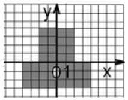

# Test task for Training center epam

## 1. Basics of software code development

### Linear programs

1. [[link]](https://github.com/Starior/Epam_java_test/blob/master/src/com/starion/loki/basics/linear/Task_1.java)
   Find the value of the function:
   
z = ( (a – 3 ) * b / 2) + c.

2. [[link]](https://github.com/Starior/Epam_java_test/blob/master/src/com/starion/loki/basics/linear/Task_2.java)
   Calculate the value of the expression using the formula (all variables are valid):
   

3. [[link]](https://github.com/Starior/Epam_java_test/blob/master/src/com/starion/loki/basics/linear/Task_3.java)
   Calculate the value of the expression using the formula (all variables are valid):
   

4. [[via numbers]](https://github.com/Starior/Epam_java_test/blob/master/src/com/starion/loki/basics/linear/Task_4_number.java) [[via strings]](https://github.com/Starior/Epam_java_test/blob/master/src/com/starion/loki/basics/linear/Task_4_string.java)
   There is a real number R of the form nnn.ddd (three digital digits in fractional and integer
   parts). Swap fractional and integer parts of the number and display the resulting value of the
   number.

5. [[link]](https://github.com/Starior/Epam_java_test/blob/master/src/com/starion/loki/basics/linear/Task_5.java)
   A natural number T is given, which represents the duration of the elapsed time in seconds.
   Display the given duration value in hours, minutes and seconds in the following form: HH MM SS.

6. [[link]](https://github.com/Starior/Epam_java_test/blob/master/src/com/starion/loki/basics/linear/Task_6.java)
   For this area, write a linear program that prints "true" if the point with coordinates (x, y)
   belongs to the filled area, and "false" otherwise:
   

### Branching

1. [[link]](https://github.com/Starior/Epam_java_test/blob/master/src/com/starion/loki/basics/branching/Task_1.java)
   The two angles of the triangle are given (in degrees). Determine if such a triangle exists, and
   if so, whether it will be rectangular.

2. [[link]](https://github.com/Starior/Epam_java_test/blob/master/src/com/starion/loki/basics/branching/Task_2.java)
   Find max {min (a, b), min (c, d)}.

3. [[link]](https://github.com/Starior/Epam_java_test/blob/master/src/com/starion/loki/basics/branching/Task_3.java)
   Three points A (x1, y1), B (x2, y2) and C (x3, y3) are given. Determine if they will be located
   on the same straight line.

4. [[link]](https://github.com/Starior/Epam_java_test/blob/master/src/com/starion/loki/basics/branching/Task_4.java)
   The dimensions A, B of the rectangular hole and the dimensions x, y, z of the brick are given.
   Determine if the brick will fit through the hole.

5. [[link]](https://github.com/Starior/Epam_java_test/blob/master/src/com/starion/loki/basics/branching/Task_5.java)
   Calculate the value of the function:
   
&space;3&space;.\end{cases}" title="F(x)=\begin{cases}x^{2}-3x+9, & \text{ if } x \leqslant 3; \\\frac{1}{x^{3}+6}, & \text{ if } x > 3 .\end{cases}" /> 

### Cycles

1. [[link]](https://github.com/Starior/Epam_java_test/blob/master/src/com/starion/loki/basics/cycles/Task_1.java)
   Write a program where the user enters any positive integer. And the program adds up all numbers
   from 1 to the number entered by the user.

2. [[link]](https://github.com/Starior/Epam_java_test/blob/master/src/com/starion/loki/basics/cycles/Task_2.java)
   Calculate the values of the function on the segment [a, b] with step h:
   
&space;2&space;\\-x,&space;&&space;\text{&space;if&space;}&space;x&space;\leqslant&space;2&space;\end{cases}" title="y=\begin{cases} x, & \text{ if } x > 2 \\-x, & \text{ if } x \leqslant 2 \end{cases}" /> 

3. [[link]](https://github.com/Starior/Epam_java_test/blob/master/src/com/starion/loki/basics/cycles/Task_3.java)
   Find the sum of the squares of the first hundred numbers.

4. [[link]](https://github.com/Starior/Epam_java_test/blob/master/src/com/starion/loki/basics/cycles/Task_4.java)
   Make a program for finding the multiplication of the squares of the first two hundred numbers.

5. [[link]](https://github.com/Starior/Epam_java_test/blob/master/src/com/starion/loki/basics/cycles/Task_5.java)
   A series of number and some number "e" are given. Find the sum of those members of the series
   whose modulus is greater than or equal to a given "e". The general member of the series is:
   

6. [[link]](https://github.com/Starior/Epam_java_test/blob/master/src/com/starion/loki/basics/cycles/Task_6.java)
   Display the correspondences between symbols and their numerical designations in the computer
   memory.

7. [[link]](https://github.com/Starior/Epam_java_test/blob/master/src/com/starion/loki/basics/cycles/Task_7.java)
   For each natural number in the range from "m" to "n", output all divisors except one and the
   number itself. "m" and "n" are entered from the keyboard.

8. [[link]](https://github.com/Starior/Epam_java_test/blob/master/src/com/starion/loki/basics/cycles/Task_8.java) [[via HashSet]](https://github.com/Starior/Epam_java_test/blob/master/src/com/starion/loki/basics/cycles/Task_8_HashSet.java)
   Two numbers are given. Determine the numbers included in the recording of both the first and
   second numbers

## 2. Algorithmization

### One-dimensional arrays

1. [[link]](https://github.com/Starior/Epam_java_test/blob/master/src/com/starion/loki/algorithmization/one_dimensional_arrays/Task_1.java)
   The array A [N] contains natural numbers. Find the sum of those elements that are multiples of a
   given K.

2. [[link]](https://github.com/Starior/Epam_java_test/blob/master/src/com/starion/loki/algorithmization/one_dimensional_arrays/Task_2.java)
   A sequence of real numbers a1, a2, ..., an is given. Replace all
   its members greater than the given Z with this number. Count the number of substitutions.

3. [[link]](https://github.com/Starior/Epam_java_test/blob/master/src/com/starion/loki/algorithmization/one_dimensional_arrays/Task_3.java)
   An array of real numbers is given, the dimension of which is N. Calculate how many negative,
   positive and zero elements there are.

4. [[link]](https://github.com/Starior/Epam_java_test/blob/master/src/com/starion/loki/algorithmization/one_dimensional_arrays/Task_4.java)
   There are real numbers a1, a2, ..., an. Swap the largest and
   smallest elements.

5. [[link]](https://github.com/Starior/Epam_java_test/blob/master/src/com/starion/loki/algorithmization/one_dimensional_arrays/Task_5.java)
   Integers a1, a2, ..., an are given. Print only those numbers for
   which ai > i.

6. [[link]](https://github.com/Starior/Epam_java_test/blob/master/src/com/starion/loki/algorithmization/one_dimensional_arrays/Task_6.java)
   A sequence of N real numbers is given. Calculate the sum of numbers whose ordinal numbers are
   prime numbers.

7. [[link]](https://github.com/Starior/Epam_java_test/blob/master/src/com/starion/loki/algorithmization/one_dimensional_arrays/Task_7.java)
   Real numbers a1, a2, ..., an are given. Find:
   
max(a1 + a2n, a2 + a2n-1,..., an + an+1)

8. [[link]](https://github.com/Starior/Epam_java_test/blob/master/src/com/starion/loki/algorithmization/one_dimensional_arrays/Task_8.java)
   A sequence of integers a1, a2, ..., an is given. Form a new
   sequence by discarding from the original those terms that are equal to min(a1, a
   2, ..., an).

9. [[link]](https://github.com/Starior/Epam_java_test/blob/master/src/com/starion/loki/algorithmization/one_dimensional_arrays/Task_9.java)
   Find the most frequent number in an array of integers with n elements. If there are several such
   numbers, then determine the smallest of them.

10. [[link]](https://github.com/Starior/Epam_java_test/blob/master/src/com/starion/loki/algorithmization/one_dimensional_arrays/Task_10.java)
    An integer array is given with the number of elements n. Compress the array by discarding every
    second element from it (fill the vacated elements with zeros). Note: Do not use an additional
    array.

### N-dimensional arrays

1. [[link]](https://github.com/Starior/Epam_java_test/blob/master/src/com/starion/loki/algorithmization/n_dimensional_arrays/Task_1.java)
   A matrix is given. Display all odd columns with the first element greater than the last.

2. [[link]](https://github.com/Starior/Epam_java_test/blob/master/src/com/starion/loki/algorithmization/n_dimensional_arrays/Task_2.java)
   A square matrix is given. Display the elements on the diagonal.

3. [[link]](https://github.com/Starior/Epam_java_test/blob/master/src/com/starion/loki/algorithmization/n_dimensional_arrays/Task_3.java)
   A matrix is given. Print the k-th row and p-th column of the matrix.

4. [[link]](https://github.com/Starior/Epam_java_test/blob/master/src/com/starion/loki/algorithmization/n_dimensional_arrays/Task_4.java)
   Form a square matrix of order n according to a given pattern (n is even):
   
  

5. [[link]](https://github.com/Starior/Epam_java_test/blob/master/src/com/starion/loki/algorithmization/n_dimensional_arrays/Task_5.java)
   Form a square matrix of order n according to a given pattern (n is even):
   
  

6. [[link]](https://github.com/Starior/Epam_java_test/blob/master/src/com/starion/loki/algorithmization/n_dimensional_arrays/Task_6.java)
   Form a square matrix of order n according to a given pattern (n is even):
   
  

7. [[link]](https://github.com/Starior/Epam_java_test/blob/master/src/com/starion/loki/algorithmization/n_dimensional_arrays/Task_7.java)
   Form a square matrix of order N according to the rule:
   
  

   and count the number of positive elements in it.

8. [[link]](https://github.com/Starior/Epam_java_test/blob/master/src/com/starion/loki/algorithmization/n_dimensional_arrays/Task_8.java)
   In a numerical matrix, swap any two columns, that is, put all the elements of one column in the
   corresponding positions of the other, and move the elements of the second to the first. Column
   numbers are entered by the user from the keyboard.

9. [[link]](https://github.com/Starior/Epam_java_test/blob/master/src/com/starion/loki/algorithmization/n_dimensional_arrays/Task_9.java)
   A matrix of non-negative numbers is given. Calculate the sum of the items in each column.
   Determine which column contains the maximum sum.

10. [[link]](https://github.com/Starior/Epam_java_test/blob/master/src/com/starion/loki/algorithmization/n_dimensional_arrays/Task_10.java)
    Find the positive elements of the main diagonal of a square matrix.

11. [[link]](https://github.com/Starior/Epam_java_test/blob/master/src/com/starion/loki/algorithmization/n_dimensional_arrays/Task_11.java)
    Fill the 10x20 matrix with random numbers from 0 to 15. Display the matrix itself and the row
    numbers in which the number 5 occurs three or more times.

12. [[link]](https://github.com/Starior/Epam_java_test/blob/master/src/com/starion/loki/algorithmization/n_dimensional_arrays/Task_12.java)
    Sort matrix rows in ascending and descending order of element values.

13. [[link]](https://github.com/Starior/Epam_java_test/blob/master/src/com/starion/loki/algorithmization/n_dimensional_arrays/Task_13.java)
    Sort matrix columns in ascending and descending order of element values.

14. [[link]](https://github.com/Starior/Epam_java_test/blob/master/src/com/starion/loki/algorithmization/n_dimensional_arrays/Task_14.java)
    Generate a random m x n matrix consisting of zeros and ones, with the number of ones in each
    column being equal to the column number.

15. [[link]](https://github.com/Starior/Epam_java_test/blob/master/src/com/starion/loki/algorithmization/n_dimensional_arrays/Task_15.java)
    Find the largest element of the matrix and replace all odd elements with it.

16. [[link]](https://github.com/Starior/Epam_java_test/blob/master/src/com/starion/loki/algorithmization/n_dimensional_arrays/Task_16.java) [[n=3 shuffle]](https://github.com/Starior/Epam_java_test/blob/master/src/com/starion/loki/algorithmization/n_dimensional_arrays/Task_16_three_n_shuffle.java)
    A magic square of order N is an NxN square matrix composed of the numbers 1, 2, 3, ..., N
    2 so that the sums for each column, each row and each of the two large diagonals are
    equal. Construct such a square. An example of a magic square of order 3:
    
 6 1 8   7 5 3   2 9 4 

### One-dimensional arrays - sorting

1. [[link]](https://github.com/Starior/Epam_java_test/blob/master/src/com/starion/loki/algorithmization/one_dimensional_arrays_sorting/Task_1.java)
   Two one-dimensional arrays with different number of elements and a natural number k are given.
   Combine them into one array, including the second array between the k-th and (k+1)-th elements of
   the first, without using an additional array.

2. [[link]](https://github.com/Starior/Epam_java_test/blob/master/src/com/starion/loki/algorithmization/one_dimensional_arrays_sorting/Task_2.java)
   Two sequences are given a1≤ a2≤...≤ an and b1≤ b
   2≤...≤ bm. Form a new sequence of numbers from them so that it is also
   non-decreasing. Note. Do not use an additional array.

3. [[link]](https://github.com/Starior/Epam_java_test/blob/master/src/com/starion/loki/algorithmization/one_dimensional_arrays_sorting/Task_3.java)
   Selection sort. Sequence of numbers a1≤ a2≤...≤ an is given. It
   is required to rearrange the elements so that they are arranged in descending order. To do this,
   in the array, starting from the first, the largest element is selected and put in the first
   place, and the first - in the place of the largest. Then, starting from the second, this
   procedure is repeated. Write a selection sorting algorithm.

4. [[link]](https://github.com/Starior/Epam_java_test/blob/master/src/com/starion/loki/algorithmization/one_dimensional_arrays_sorting/Task_4.java)
   Bubble sort. Sequence of numbers a1≤ a2≤...≤ an is given. It is
   required to rearrange the numbers in ascending order. For this, two adjacent numbers a
   i and ai+1 are compared. If ai > ai+1, then a permutation
   is done. This continues until all the elements are arranged in ascending order. Create a sorting
   algorithm, while counting the number of permutations.

5. [[link]](https://github.com/Starior/Epam_java_test/blob/master/src/com/starion/loki/algorithmization/one_dimensional_arrays_sorting/Task_5.java)
   Insertion sort. Sequence of numbers a1≤ a2≤...≤ an is given. It
   is required to rearrange the numbers in ascending order. This is done as follows. Let a
   1≤a2≤...≤ai be an ordered sequence, that is, a1≤a
   2≤...≤an. The next number ai+1 is taken and inserted into the
   sequence so that the new sequence is also increasing. The process is carried out until all
   elements from i +1 to n are enumerated. Note. Place the next element in the sorted part using a
   binary search. Binary search should be presented as a separate function.

6. [[link]](https://github.com/Starior/Epam_java_test/blob/master/src/com/starion/loki/algorithmization/one_dimensional_arrays_sorting/Task_6.java)
   Shell sort. An array of n real numbers is given. Sort it in ascending order. This is done as
   follows: two neighboring elements ai and ai+1 are compared. If a
   i≤ ai+1, then move forward one element. If ai> ai+1, then
   a permutation is performed and shifted one element back. Create an algorithm for this sorting.

7. [[link]](https://github.com/Starior/Epam_java_test/blob/master/src/com/starion/loki/algorithmization/one_dimensional_arrays_sorting/Task_7.java)
   Two non-decreasing sequences of real numbers a1≤ a2≤...≤ an and
   b1≤ b2≤...≤ bm are given. It is required to indicate the places
   where the elements of the sequence b1≤ b2≤...≤ bm should be
   inserted into the first sequence so that the new sequence remains increasing

8. [[link]](https://github.com/Starior/Epam_java_test/blob/master/src/com/starion/loki/algorithmization/one_dimensional_arrays_sorting/Task_8.java)
   Fractions <em>p1</em>/<em>q1</em>, <em>p2</em>/<em>q
   2</em>, ..., <em>pn</em>/<em>qn</em>, (<em>pi</em>, <em>
   qi</em> - natural) are given. Write a program that brings these fractions to a common
   denominator and orders them in ascending order.

### Decomposition

1. [[link]](https://github.com/Starior/Epam_java_test/blob/master/src/com/starion/loki/algorithmization/decomposition/Task_1.java)
   Write a method(s) for finding the greatest common divisor and the least common multiple of two
   natural numbers:
    
  

2. [[link]](https://github.com/Starior/Epam_java_test/blob/master/src/com/starion/loki/algorithmization/decomposition/Task_2.java)
   Write a method(s) for finding the greatest common divisor of four natural numbers.

3. [[link]](https://github.com/Starior/Epam_java_test/blob/master/src/com/starion/loki/algorithmization/decomposition/Task_3.java)
   Calculate the area of a regular hexagon with side 'a' using the triangle area method

4. [[link]](https://github.com/Starior/Epam_java_test/blob/master/src/com/starion/loki/algorithmization/decomposition/Task_4.java)
   On the plane, n points are given by their coordinates. Write a method (methods) that determine
   which of the pairs of points is the greatest distance. Indication. Enter the coordinates of the
   points into the array.

5. [[link]](https://github.com/Starior/Epam_java_test/blob/master/src/com/starion/loki/algorithmization/decomposition/Task_5.java)
   Write a program that finds the second largest number in the array A [N] (print out a number that
   is less than the maximum element of the array, but larger than all other elements).

6. [[link]](https://github.com/Starior/Epam_java_test/blob/master/src/com/starion/loki/algorithmization/decomposition/Task_6.java)
   Write a method (s) that checks whether the given three numbers are coprime.

7. [[link]](https://github.com/Starior/Epam_java_test/blob/master/src/com/starion/loki/algorithmization/decomposition/Task_7.java)
   Write a method (s) for calculating the sum of the factorials of all odd numbers from 1 to 9.

8. [[link]](https://github.com/Starior/Epam_java_test/blob/master/src/com/starion/loki/algorithmization/decomposition/Task_8.java)
   An array D is given. Determine the following sums: D [l] + D [2] + D [3]; D [3] + D [4] + D [5];
   D [4] + D [5] + D [6]. Explanation. Create a method (s) to calculate the sum of three consecutive
   array elements with numbers from k to m.

9. [[link]](https://github.com/Starior/Epam_java_test/blob/master/src/com/starion/loki/algorithmization/decomposition/Task_9.java)
   The numbers X, Y, Z, T are given - the lengths of the sides of the quadrangle. Write a method(s)
   for calculating its area if there is a right angle between sides of length X and Y.

10. [[link]](https://github.com/Starior/Epam_java_test/blob/master/src/com/starion/loki/algorithmization/decomposition/Task_10.java)
    A natural number N is given. Write a method (methods) for forming an array, the elements of
    which are the digits of the number N.

11. [[link]](https://github.com/Starior/Epam_java_test/blob/master/src/com/starion/loki/algorithmization/decomposition/Task_11.java)
    Write a method(s) that determines which of the given two numbers has more digits.

12. [[link]](https://github.com/Starior/Epam_java_test/blob/master/src/com/starion/loki/algorithmization/decomposition/Task_12.java)
    Natural numbers K and N are given. Write a method (methods) for forming an array A, the elements
    of which are numbers, the sum of the digits of which is equal to K and which are not greater
    than N.

13. [[link]](https://github.com/Starior/Epam_java_test/blob/master/src/com/starion/loki/algorithmization/decomposition/Task_13.java)
    Two primes are called "twins" if they differ from each other by 2 (for example, 41 and 43). Find
    and print all pairs of "twins" from the segment [n, 2n], where n is a given natural number
    greater than 2. To solve the task, use the decomposition.

14. [[link]](https://github.com/Starior/Epam_java_test/blob/master/src/com/starion/loki/algorithmization/decomposition/Task_14.java) [[True Armstrong number]](https://github.com/Starior/Epam_java_test/blob/master/src/com/starion/loki/algorithmization/decomposition/Task_14_True_Armstrong_number.java)
    A natural number with n digits in it is called the Armstrong number if the sum of its digits
    raised to the power n is equal to the number itself. Find all Armstrong numbers from 1 to k. To
    solve the task, use decomposition.

15. [[link]](https://github.com/Starior/Epam_java_test/blob/master/src/com/starion/loki/algorithmization/decomposition/Task_15.java)
    Find all natural n-digit numbers whose digits form a strictly increasing sequence (for example,
    1234, 5789). To solve the task, use decomposition.

16. [[link]](https://github.com/Starior/Epam_java_test/blob/master/src/com/starion/loki/algorithmization/decomposition/Task_16.java)
    Write a program that determines the sum of n-digit numbers containing only odd digits. Also
    determine how many even digits are in the found amount. To solve the task, use decomposition.

17. [[link]](https://github.com/Starior/Epam_java_test/blob/master/src/com/starion/loki/algorithmization/decomposition/Task_17.java)
    The sum of its digits was subtracted from the given number. The sum of its digits was again
    subtracted from the result, etc. How many such actions must be performed to get zero? To solve
    the task, use decomposition.

## 3. Strings and basics of text processing

### Working with a string as an array of characters

1. [[link]](https://github.com/Starior/Epam_java_test/blob/master/src/com/starion/loki/strings/string_as_array/Task_1.java)
   An array of camelCase variable names is given. Convert titles to snake_case.

2. [[link]](https://github.com/Starior/Epam_java_test/blob/master/src/com/starion/loki/strings/string_as_array/Task_2.java)
   Replace all occurrences of 'word' in the string with 'letter'.

3. [[link]](https://github.com/Starior/Epam_java_test/blob/master/src/com/starion/loki/strings/string_as_array/Task_3.java)
   Find the amount of digits in the string.

4. [[link]](https://github.com/Starior/Epam_java_test/blob/master/src/com/starion/loki/strings/string_as_array/Task_4.java)
   Find the amount of numbers in the string.

5. [[link]](https://github.com/Starior/Epam_java_test/blob/master/src/com/starion/loki/strings/string_as_array/Task_5.java)
   Remove all extra spaces in the line, that is, replace series of consecutive spaces with single
   spaces. Remove trailing spaces in the line.

### Working with a string as an object of type String or StringBuilder

1. [[link]](https://github.com/Starior/Epam_java_test/blob/master/src/com/starion/loki/strings/string_as_object/Task_1.java)
   A text(string) is given. Find the largest number of consecutive spaces in it.

2. [[link]](https://github.com/Starior/Epam_java_test/blob/master/src/com/starion/loki/strings/string_as_object/Task_2.java)
   In the line insert after each 'a' character 'b'.

3. [[link]](https://github.com/Starior/Epam_java_test/blob/master/src/com/starion/loki/strings/string_as_object/Task_3.java)
   Check if the given word is a palindrome.

4. [[link]](https://github.com/Starior/Epam_java_test/blob/master/src/com/starion/loki/strings/string_as_object/Task_4.java)
   Use the copy function and the concatenation operation to form the word “total” from the parts of
   the word “atoll”.

5. [[link]](https://github.com/Starior/Epam_java_test/blob/master/src/com/starion/loki/strings/string_as_object/Task_5.java)
   Count how many times the letter "a" occurs among the characters of a given string.

6. [[link]](https://github.com/Starior/Epam_java_test/blob/master/src/com/starion/loki/strings/string_as_object/Task_6.java)
   Get a new one from the given string by repeating each character twice.

7. [[link]](https://github.com/Starior/Epam_java_test/blob/master/src/com/starion/loki/strings/string_as_object/Task_7.java)
   A string is entered. It is required to remove duplicate characters and all spaces from it. For
   example, if "abc cdedef" was entered, then "abcdef" should be output.

8. [[link]](https://github.com/Starior/Epam_java_test/blob/master/src/com/starion/loki/strings/string_as_object/Task_8.java) [[via String[]]](https://github.com/Starior/Epam_java_test/blob/master/src/com/starion/loki/strings/string_as_object/Task_8_String_Array.java)
   A string of words is entered, separated by spaces. Find the longest word and display it on the
   screen. The case when there may be several longest words, do not process.

9. [[link]](https://github.com/Starior/Epam_java_test/blob/master/src/com/starion/loki/strings/string_as_object/Task_9.java)
   Count the number of lowercase and uppercase letters in the entered line. Consider only English
   letters.

10. [[link]](https://github.com/Starior/Epam_java_test/blob/master/src/com/starion/loki/strings/string_as_object/Task_10.java)
    Line X consists of several sentences, each ending with a dot, exclamation mark, or question
    mark. Determine the number of sentences in line X.

### Working with regular expressions (Pattern, Matcher)